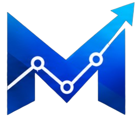

# MUSTEX DIGITAL

### Building Digital Solutions That Drive Business Growth

We design, develop, and scale digital solutions that help businesses transform ideas into powerful digital experiences.

 

---

## 👋 About Mustex Digital

Mustex Digital is a technology-driven digital solutions company helping businesses build, launch, and grow in the modern digital landscape.

We combine:

**Technology + Creative Design + Business Strategy**

to create websites, applications, automation systems, and digital products that are built for performance, scalability, and growth.

---

# 🚀 Our Expertise

<table>

<tr>

<td width="50%">

## 🌐 Web Development

Modern websites focused on performance, accessibility, and conversions.

✓ Business Websites  
✓ Landing Pages  
✓ E-commerce Solutions  
✓ Responsive Experiences  

</td>

<td width="50%">

## 💻 Full Stack Development

Scalable applications engineered with modern architecture.

✓ Frontend Systems  
✓ Backend Development  
✓ APIs  
✓ Database Solutions  

</td>

</tr>

<tr>

<td>

## 📱 Mobile App Development

Reliable mobile applications designed for today's users.

✓ Android Applications  
✓ Flutter Development  
✓ Cross Platform Apps  

</td>

<td>

## 🤖 AI Automation

Helping businesses improve efficiency through intelligent systems.

✓ AI Workflows  
✓ Smart Integrations  
✓ Business Automation  

</td>

</tr>

<tr>

<td>

## ☁️ Cloud Solutions

Building secure and scalable digital infrastructure.

✓ Cloud Architecture  
✓ Server Management  
✓ Deployment Solutions  

</td>

<td>

## 🎨 UI/UX Design

Creating digital experiences users love.

✓ Product Design  
✓ User Experience  
✓ Design Systems  

</td>

</tr>

<tr>

<td colspan="2">

## 📈 Digital Marketing & Growth

Combining technology and strategy to help brands grow online.

✓ Digital Strategy  
✓ Brand Growth  
✓ Online Presence  

</td>

</tr>

</table>

---

# 🛠️ Technology Stack

---

# ⚡ How We Work

Understanding The Business
↓
Creating The Strategy
↓
Designing The Experience
↓
Building The Solution
↓
Optimizing For Growth

We don't just create digital products.

We create solutions designed around real business goals.

---

# 📌 What We Build

🚀 Business Websites  
📱 Mobile Applications  
💻 SaaS Platforms  
🤖 AI Automation Systems  
⚙️ Custom Software Solutions  
📊 Digital Growth Platforms  

---

# 📂 Featured Projects

Currently building and showcasing solutions across:

| Project Type | Focus |
|---|---|
| Websites | Modern Business Experiences |
| Applications | Scalable Digital Products |
| Automation | Smarter Workflows |
| Software | Custom Business Solutions |

More projects coming soon.

---

# 📊 Development Philosophy

> Great technology is not only about writing code.
>
> It is about solving problems, improving experiences, and creating measurable impact.

---

# 🤝 Let's Build Something Great

Have a business idea, software requirement, or digital challenge?

We would love to collaborate.

📞 Contact: **+92 304 3325478**

🔗 LinkedIn: https://www.linkedin.com/company/mustex-digital/?viewAsMember=true

🌐 Website: https://mustexdigital.com

---

## We Build Brands. We Grow Businesses.

⭐ Explore our work • Connect with us • Build the future

